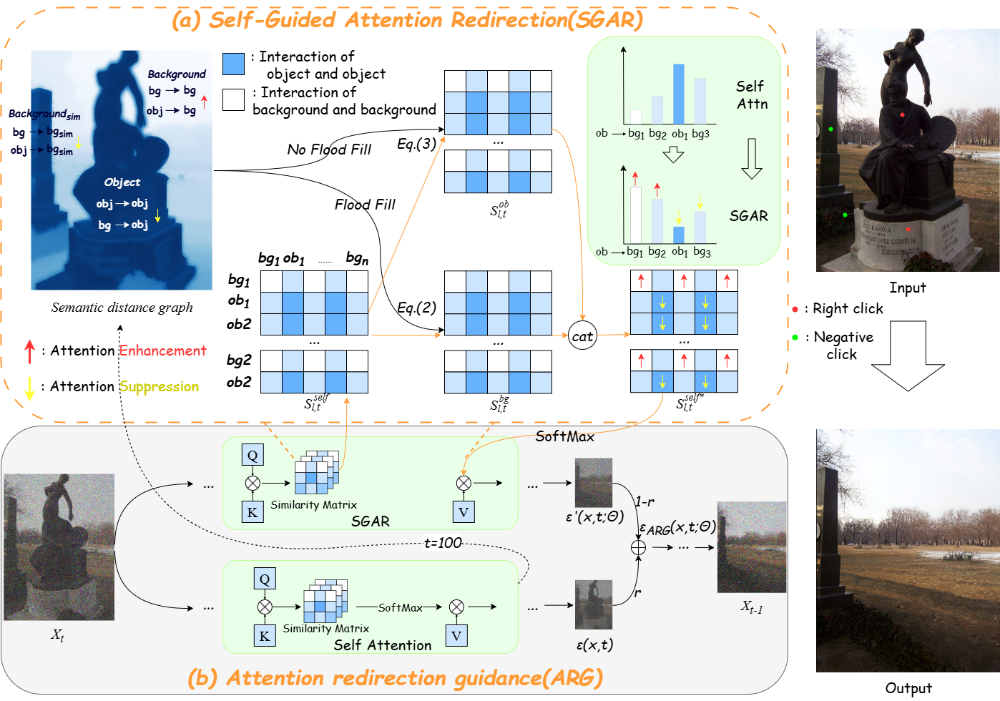

# ClickRemoval: An Interactive Open-Source Tool for Object Removal in Diffusion Models

ClickRemoval is a **fully open‑source, training‑free** object removal tool built on pretrained latent diffusion models (Stable Diffusion).
## Qualitative Comparison

The figure below compares ClickRemoval with several baseline methods (e.g., LaMa, SD-Inpaint, etc.) on object removal tasks.

  
   
  <em>Figure: Visual comparison of different models. ClickRemoval removes target objects more thoroughly and restores backgrounds more naturally.</em>

## Key Features

- **Plug‑and‑play** – Works with any Stable Diffusion model that contains self‑attention layers (SD1.5, SD2.1, SDXL, and their fine‑tuned variants).
- **Click‑only interaction** – No masks, no text prompts, no training. Supports positive/negative clicks for higher precision.
- **Innovative attention modulation** – SGAR & SGAS unify localisation and inpainting in a single forward pass, avoiding error accumulation of multi‑stage systems.

## Model Architecture

The figure below illustrates the overall architecture of ClickRemoval.

  
   
  <em>Figure: Qualitative comparison with baseline methods. Green points indicate positive clicks for removal, and red points indicate negative clicks for preservation.</em>

## Supported Backbones

| Model | Steps | Use Case | Download |
|-------|-------|----------|----------|
| SD1.5  | 25    | Lightweight, real‑time, resource‑constrained devices | [⬇️ SD1.5](https://huggingface.co/runwayml/stable-diffusion-v1-5) |
| SD2.1  | 50    | Balanced quality and speed | [⬇️ SD2.1](https://huggingface.co/stabilityai/stable-diffusion-2-1) |
| SDXL   | 50    | High‑quality removal for production use | [⬇️ SDXL](https://huggingface.co/stabilityai/stable-diffusion-xl-base-1.0) |

All variants are fully compatible with community fine‑tuned models (e.g. anime, photorealistic).

## What's New

**2026-04-03** – Full code refresh, updated requirements, GitHub sync → project fully runnable.  

**2026-04-23** – Added Dockerfile (with cuDNN support) and model download shell script; fixed multiple bugs and vulnerabilities in inference code.

**2026-05-02** – Added interactive Gradio demo (`app.py`) and a complete Jupyter Notebook tutorial (`ClickRemoval_Test_Tutorial.ipynb`).  
*More updates coming soon...*

> 🚀 The tool is fully open‑source under the Apache‑2.0 license.  
> 🔗 Repository: [https://github.com/zld-make/ClickRemoval](https://github.com/zld-make/ClickRemoval)  
> 🐳 Docker image and live demo are also available.
